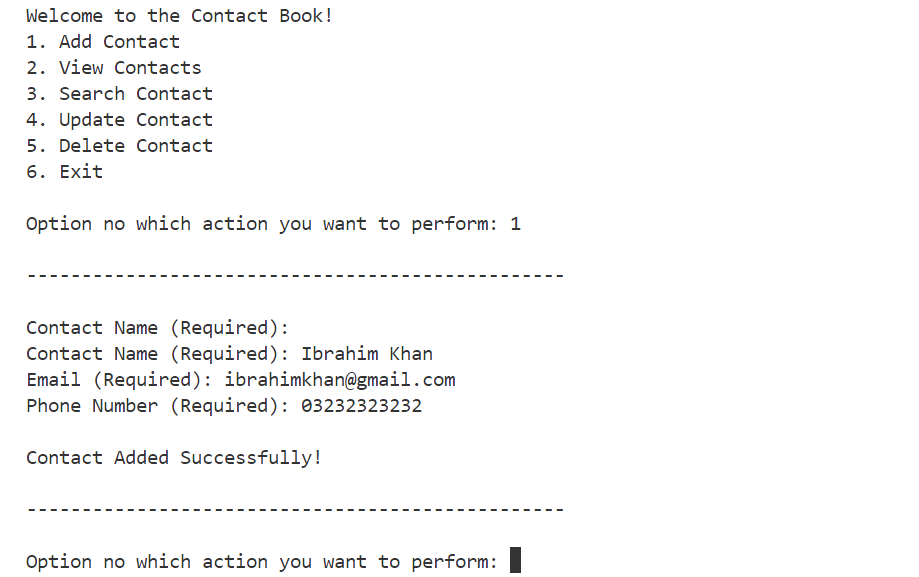
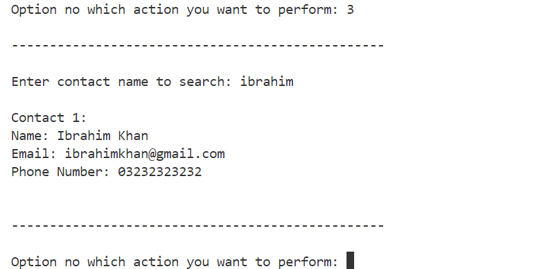
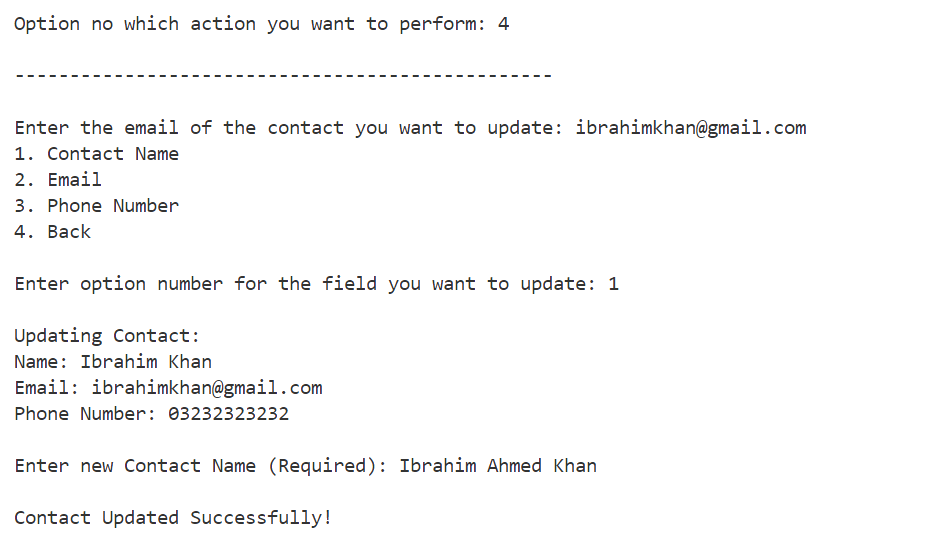
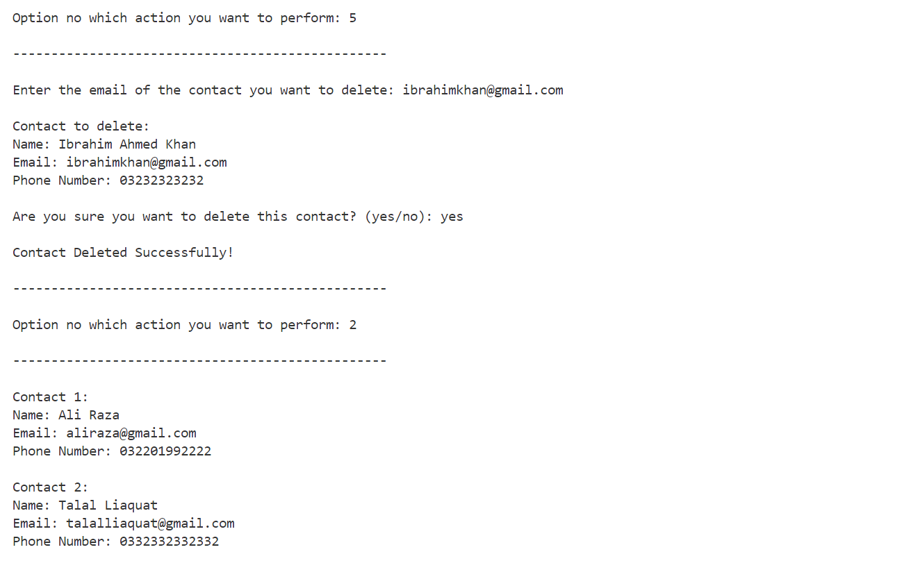

# 📒 Contact Book | Python Command-Line Project

A simple and functional **Contact Book** developed using Core Python. This command-line project helps reinforce fundamental Python concepts such as data structures, string methods, and CRUD operations.

---

 

---

## 📋 Table of Contents
- [📒 Contact Book | Python Command-Line Project](#-contact-book--python-command-line-project)
  - [📋 Table of Contents](#-table-of-contents)
  - [📚 Project Overview](#-project-overview)
  - [🚀 Features](#-features)
  - [🧠 Concepts Covered](#-concepts-covered)
  - [⚙️ Installation](#️-installation)
  - [🎮 How to Use](#-how-to-use)
  - [📸 Screenshots](#-screenshots)
  - [🚧 Future Enhancements](#-future-enhancements)
  - [✨ Author](#-author)
  - [📄 License](#-license)

---

## 📚 Project Overview

This is a command-line **Contact Book** application built using **pure Core Python**. It allows users to perform basic operations such as adding, viewing, searching, updating, and deleting contacts.

**Key Objectives:**
- Strengthen Python basics through CRUD operations  
- Work with lists, dictionaries, and string methods  
- Understand real-world data handling in Python

---

## 🚀 Features

✅ Add new contacts  
✅ View all saved contacts  
✅ Search contacts by name 
✅ Update existing contact details  
✅ Delete a contact from the list  
✅ Exit the application safely  

---

## 🧠 Concepts Covered

- Variables and User Input  
- String Methods: `lower()`
- Data Structures: Lists & Dictionaries  
- Conditional Statements (`if`, `else`)  
- Loops: `for`, `while`  
- Operators: Logical (`and`, `or`), Membership (`in`, `not in`)  
- List Methods: `append()`, `remove()`  

---

## ⚙️ Installation

```bash
# Clone the repository
git clone https://github.com/aayantasneem/contact-book.git

# Navigate to the project directory
cd contact-book

# Run the application
python contact_book.py

---

## 🎮 How to Use

1. Launch the script in your terminal using python contact_book.py.
2. You'll see a menu with options to add, view, search, update, or delete contacts.
3. Follow the prompts to perform the desired action.
4. Select option 6 to exit the program safely.

---

## 📸 Screenshots

> 
> 
> 
> 
> 
> 

---

## 🚧 Future Enhancements

- Implement GUI version using Tkinter
- Add contact grouping or tags
- Enable contact import/export from CSV
- Connect to a database for advanced storage and querying

---

## ✨ Author

Developed with ❤️ by [M. Aayan Tasneem](https://github.com/aayantasneem)
> **LinkedIn**: [https://www.linkedin.com/in/muhammadaayantasneem](https://www.linkedin.com/in/muhammadaayantasneem)

---

## 📄 License

This project is licensed under the **MIT License**. See the [LICENSE](LICENSE) file for details.
